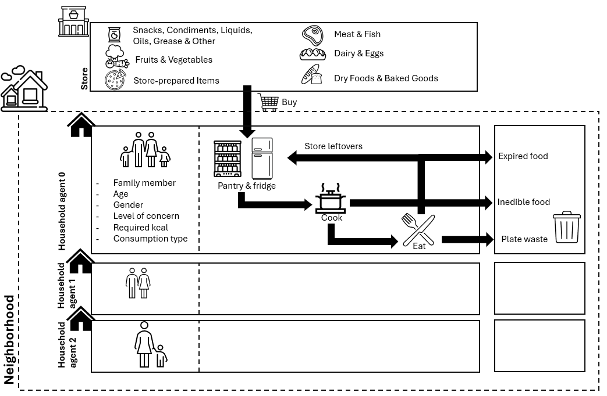

# IFWASTE project

The model includes household agents that purchase groceries from the store and store them, cook with ingredients and eat meals. During this process different waste types are being produced and monitored, analyzed and visualized. 

## Directory Structure 

    
    📦model
    ┣ 📜Child.py
    ┣ 📜CookedFood.py
    ┣ 📜Food.py
    ┣ 📜House.py
    ┣ 📜Neighborhood.py
    ┣ 📜Person.py
    ┣ 📜Store.py
    ┣ 📜main.py
    ┣ 📜globalValues.py
    ┗ 📜Storage.py
    📦analysis
    ┣ report.Rmd
    ┣ 📂plots
    ┃ ┣ 📜bought_hh_servings.png
    ┃ ┣ 📜...
    📦data
    ┗ 📂2024-04-10at09-45
    ┃ ┣ 📜bought.csv
    ┃ ┣ 📜eaten.csv
    ┃ ┣ 📜wasted.csv
    ┃ ┣ 📜still_have.csv
    ┃ ┣ 📜daily.csv
    ┃ ┗ 📜config.csv
    ┗

 ## Requirements 
The project is developed in Python 3.9.13. 
The analysis is devleoped using R version 4.3.3, you might require extra installations to run 
the R-markdown format. 

 ## Running the project
In order to run the simulation follow these steps: 

1. Download/clone the git repository 
2. Run [main.py](model/main.py) located in the model folder

After the simulation finished you should find a new folder with the current timestamp being generated in the data folder. It includes the generated .csv files that can be used for further analysis. 

You can analyze them yourself of navigate to the [report.Rmd](analysis/report.Rmd), located in the analysis folder to generate predefined graphics. Therefore follow the next steps. 

1. Open *report.md*. 
2. Follow the instruction 0-4 in the report including: 
   1. Installing missing libraries
   2. Defining the folder path of the input path (you might have to change the / to \ if you are using Mac)
   3. Choose, whether you want to save the files directly
   4. Optionally, change the design settings 

Once you got familar with this workflow, you can also change the simulation parameters.
For now most parameter are defined directly in the class, a few have already been migrated to *globalValues.py*. 

## Parameterization of the simulation

| **Parameter** | **Description** | **Value** |
|:----------------------------:|-----------------------------------------------------------------------------------------|:------------------:|
| EXPIRATION\_THRESHOLD        | expiry threshold causing a family, that eats by expiry date to use this ingredient first | 4                  |
| MIN\_TIME\_TO\_COOK          | minimal required time to be able to cook                                                 | 0.8 (48min)        |
| SERVINGS\_PER\_GRAB          | portion in servings of an ingredient that is taken when choosing ingredients for a meal  | 8                  |
| KCAL\_PER\_GRAB              | portion in kcal of an ingredient that is taken when choosing ingredients for a meal      | 100                |
| INGREDIENTS\_PER\_QUICKCOOK  | number of ingredients used for a quickcook                                               | 2                  |
| MAX\_SCALER\_COOKING\_AMOUNT | maximal multiplier for how much more food to cook, 1 is for one day                      | 3                  |
| SERVING\_SIZES               | portion sizes that are can be purchased at the store                                     | [6,12,20]          |
| ADULT\_AGE\_MIN              | minimal considered adult age                                                             | 18                 |
| ADULT\_AGE\_MAX              | maximal considered adult age                                                             | 65                 |
| ADULT\_CONCERN\_MIN          | minimal concern value for eating expiring food, range 0-1                                | 0.3                |
| ADULT\_CONCERN\_MAX          | maximal concern value for eating expiring food, range 0-1                                | 0.7                |
| CHILD\_CONCERN\_MIN          | minimal concern value for eating expiring food, range 0-1                                | 0                  |
| CHILD\_CONCERN\_MAX          | maximal concern value for eating expiring food, range 0-1                                | 0.3                |
