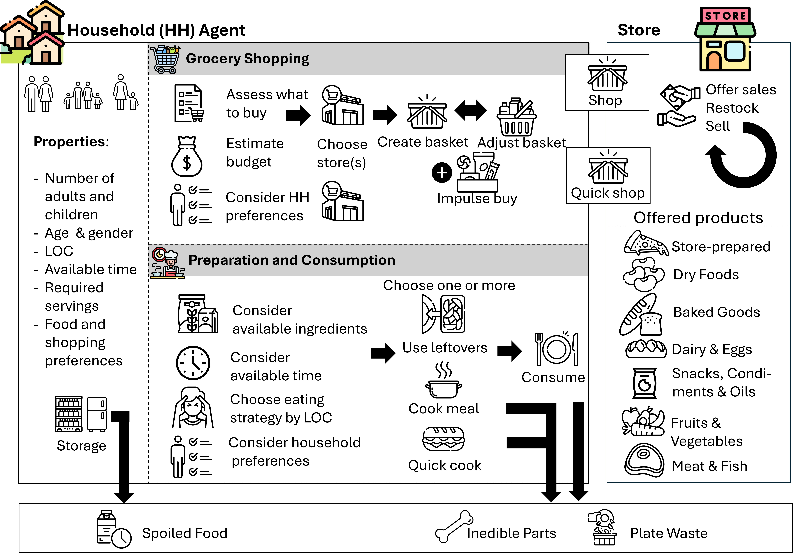

-> - QUickshop time muss kleiner sein als min time avail - max time cookigg / 2 - damit immer möglich = aktuell 15


# IFWASTE project introduction
We present the IFWASTE model, an agent-based model designed to simulate HFW dynamics. It captures the process from food acquisition to preparation, consumption, leftover management, and eventual disposal. This version of the model specifically focuses on the grocery shopping process of households, exploring potential ripple effects towards HFW generation. The model is highly configurable and thus allows comparison of different study scenarios as well as analysis of the contribution of individual factors towards HFW and broader population trends. Our contribution includes setting a baseline for estimating HFW using an agent-based modeling approach while also offering a foundation for policy discussions, ultimately contributing to a more sustainable food system.




# Publications
### Preprint [Currently under review]: Modeling Waste: An Agent-Based Model to Support the Measurement of Household Food Waste
This paper focuses on the first version of the model  
Link to the preprint: <https://papers.ssrn.com/sol3/papers.cfm?abstract_id=5017237>  
DOI: 10.2139/ssrn.5017237

# Installation
## Cloning the repository
compare [github-tutorial](https://docs.github.com/en/repositories/creating-and-managing-repositories/cloning-a-repository)

1. Navigate to the main page of the repository.
2. Above the list of files, click **<> Code**.
3. You can either clone the repository using HTTPS, SSH (which requires a SSH key setup) or download the zip file
   1. **HTTPS/SSH**
      1. Open a git bash locally
      2. type: `git clone https://github.com/YOUR-USERNAME/YOUR-REPOSITORY`and press enter
   2. **Download ZIP**: 
      1. Click on download zip and extract the folder locally
## Installing the required libraries
The project is developed in [Python 3.12.2](https://www.python.org/downloads/release/python-3122/). If you do not have python on your computer, install it first and then return to this step.

Next you have to install the libraries that are used in the model. I highly recommend not installing libraries directly but rather encapsulating them in a virtual environment to manage different versions for different projects. To do so, I use Mamba, a lightweight version of Anaconda. Most steps should be reproducible with Anaconda, Conda or Miniconda as well. Make sure you have either installed. 

Create a new environment based and install the required libraries with this command: 

For Mamba:  
    
    mamba env create -f environment.yml
For Conda and Anaconda:
    
    conda env create -f environment.yml


After the creation process is complete, you can activate the newly created virtual environment.  

For Mamba:

    mamba activate ifwaste-env
For Conda and Anaconda

    conda activate ifwaste-env

# Running the project
After the download of the repository and the installation of the required pythong libraries is concluded, a simulation can be run:

Running a simulation of the model comprises of multiple steps. 
1. [Defining the experiment](#Defining-the-experiment)
2. [Generating the samples](#Generating-#the-samples)
3. [Running an experiment](#Running-a-simple-experiment)
4. [Analyzing the results](#Analyzing-the-results)

## Defining the experiment
The first step it to define the experiment that you want to simulate. There are many options of defining how your neighborhood should be set up, how your household agents are characterized and acting or what kind of stores offer which products and sales. 

To define each of the components there are multiple json files located in the `input/gsua_templates` folder. It is recommended to first run the existing example configuration to see if your setup is correct. 

After everything works fine, follow your own creativity! To run your own experiment, first make a copy of the existing files in the `input/gsua_based_configuration` folder and then give the folder a scenario name. 

All experiment parameters are explained in this table: [Simulation parameter description](#Simulation-parameter-description)

When defining your own experiments each parameter needs to define the `layer` it is living on and be defined as either defined as a constant (defined through the `value` parameter and `layer` = *simulation*) or as variable parameter (defined through `distribution`with `bounds`, `dtype`  and `decimals`)


### Layers
The simulation consists of three layers.

- The first layer is the *simulation* layer, meaning that all variables that are defined on this layer will be the same across multiple runs of the same experiment setup. 
- The next layer is the *neighborhood* layer. All parameters on this layer will be the same within a single experiment. It is called the neighborhood layer as it mainly defines characteristics like the number of stores in neighborhood, the distance between locations in the neighborhood etc. These parameters are consistent within the a neighborhood. Different simulation runs can have different neighborhood definitions. 
- The third layer is called *household*. All parameters on this layer are consistent within a household. As most simulations will incorporate more than a single household in the neigborhood it is important to define diversity within the households. An example for a typical variable on this layer would be the number of adults, as it can vary from house to house within a single simulation. 


**Example: What happens if I defined the amount of children on different layers?**
- Simulation layer: Across all simulation layers all households will always have the exact same number of children  
    ```"hh_amount_children" : {"value" : 2, "layer":"simulation"},```
- Neighborhood layer: Across simulations the number of children can vary (based on `distribution`with `bounds`, `dtype`  and `decimals`), but in each neigborhood households will always have the same amount of children  
    ```"hh_amount_children" : {"distribution" : "unif", "bounds":[0,6],"dtype":"int", "layer":"neighborhood"},```
- Household layer: Across simulations and neighborhoods the number of children can vary, allowing diverse household sizes within a single simulation  
    ```"hh_amount_children" : {"distribution" : "unif", "bounds":[0,6],"dtype":"int", "layer":"household"},```

### Constants vs. variable parameter
Defining a constant is pretty straightforward. For `your_variable`you define the value of your choice and adjust the layer to "*simulation"* 
    ```<your_variable>:{"value": <constant_value>, "layer":"simulation" }```

Defining a variable parameter is bit more complex. 

- Choose the layer
- Choose the distribution and bounds
- Choose the datatype and decimals

First you choose the layer the variable is associated with (either *"household"* or *"neighborhood"*). Then you choose a distribution that is used to sample the values. 
Currently you can choose from the following list of distributions: 

- *"unif"*: Uniform distribution, *"bounds"*: [min, max]
- *"triang"*: Triangular distribution, *"bounds"*: [min, peak, max]
- *"vector*": A uniform distribtuion that is applied N times to a vector of values to organize and reduce the number of parameters in the JSON files, *"bounds"*: [min,max], requires *"length"* parameter that describes the vector length as an integer
- *"sales"*: Special distribution to choose the sale options, requires *"options"* parameter that is a list of sale types to sample from

At last, the datatype and number of decimals is defined. This is important as some parameters might have to be integers while others are floats. For example the number of children always has to be rounded to the next integer within the bounds, whereas the quality sensitivity is a percentage encoded as a float between 0 and 1. 

The datatype is encoded through the parameter *"dtype"* being either *"int"* or *"float"*. You do not have to define the datatype for constants, as the values does not change from your defined value. When encoding a values a  a float you additionally have to define the parameter *"decimals"* and set this the number of decimals you want to road the float to. 

**Examples:**
**Uniform distribution, integer**

``"hh_amount_children" : {"distribution" : "unif", "bounds":[0,6],"dtype":"int", "layer":"household"}``

**Uniform distribution, float rounded to 2 decimals**

``"high_stock_interval_1": {"distribution":"unif", "bounds": [1,1.5], "dtype":"float", "decimals": "2","layer":"neighborhood"}``


**Triangular distribution, float rounded to 1 decimal**

``"travel_time_per_cell" : {"distribution":"triang","bounds":[3,7,0.5], "dtype":"float","decimals": "1", "layer":"neighborhood"}``

**Vector-based uniform distribution, integer**

``"nh_store_amounts": {"distribution":"vector", "length": 3, "bounds":[0,1], "dtype":"int", "layer":"neighborhood"}``

**Sales uniform distribution**

``"clearance_interval_1_discount" : {"distribution":"sales", "options":["BOGO", "DISCOUNT20","DISCOUNT30","DISCOUNT40","DISCOUNT50"], "layer":"neighborhood"}``

### Defining store products
After defining all parameter for the experiments the last thing to define is the product range of each store type. Located in the `input/store_product` folder you can find a csv file per store with an example of product ranges. You can add and remove items. Items are defined through a type string [FGSNACKS, FGSTOREPREPARED, FGDAIRY, FGDRYFOOD, FGMEAT, FGVEGETABLE, FGBAKED], a number of servings they come in and a price per serving.

**Example:**
| type             | servings | price_per_serving |
|------------------|----------|-------------------|
| FGSNACKS         | 4        | 2.28              |
| FGSTOREPREPARED  | 1        | 7.5               |
| FGDRYFOOD        | 1        | 0.345             |
| FGDAIRY          | 1        | 0.75              |
| FGMEAT           | 1        | 1.5               |
| FGSNACKS         | 2        | 2.28              |
| FGSTOREPREPARED  | 2        | 7.5               |
| FGDAIRY          | 2        | 0.75              |

## Generating the samples
The next step is generating the actual values the simulation will run with on each layer. In this step we are sampling values from the defined distribution to create our final input file that the simulation will be parameterized with. The benefit of doing this in an extra step is that we then have a file with all parameters for all households, that can be used for putting results into context during analysis. 

To generate the files, open the `gsua_parameter_generation.ipynb` notebook in the input folder. 
Adjus the `SCENARIO` variable to your own scenario folder name. Adjust the `CONFIG_DIR`aand `SAVE_DIR` and choose l, N and whether to use the `LATIN_HYPERCUBE_SAMPLING` (True) method or `SOBOL` (False). For further information refer to the work of  A. Carmona-Cabrero and R. Muñoz-Carpena, University of Florida. The paper can be found  in JASS:  [(Carmona-Cabrero et al., 2024)](https://doi.org/10.18564/jasss.5174) 

Now you can run the entire notebook. If everything worked you should find 9 txt files in the `/input/gsua_based_configuration/samples/` folder under your scenario name. 

## Running a simple experiment
After defining the samples you can either execute a single run locally or perform a setup of runs of different scenarios. 

For the local execution you can either run it through your editor (but will have to define input arguments) or run it through the terminal. 

Open a terminal and navigate to the `model` folder using the `cd` command. 
Then type the following line and replace `PATH` with the path to the scenario folder.

    python main.py --full_csv --agg_csv --path <PATH> --nh_id 0 --hh_id all --sim_run_id 0

You can also not set the `--full_csv` or `--agg_csv` flags and just remove them from the command. Here is what they mean: 

- `full_csv`: Create the following output csv files: `log_bought.csv`, `log_eaten.csv`, `log_grid.csv`, `log_hh_config.csv`,`log_hh_daily.csv`, `log_still_have.csv`, `log_store_daily.csv`, `log_wasted.csv`
- `agg_csv`: Create the aggregated output csv file `aggregated_outputs.csv`

The other parameter are used to determine which lines from the sample should be used to define the parameters of the experiment. You usually dont have to adjust them. The current setup `--hh_id all` defines that all households should be different based on **all** generated samples. The neighborhood `--nh_id 0` is defined through the first line of the list of samples. 

## Submitting the experiment to HiperGator
The final step is submitting the experiment to HiperGator. For that open the `submit_jobs.sh` file and add all scenarios you want to run to the scenario list. You can also adjust how often you want each scenario to be run by changing the number of iterations in the same script.

Open the `submit_jobs.sh` folder and add the names of the folders with the generated samples in the scenarios list. Add the number of replications you would like to run (minus one as it start with run 0). Then open the `run_1_nh_all_hh_n_times.sh` script. Adjust the HPC parameter as needed. Add your email address to receive an updated on completed and failed experiments or remove the two lines related to mails. 

Now open a terminal and navigate to the `model_starter` folder. Type:  
    
    sbatch submit_jobs.sh 

This bash-script creates a jobs of the number of iterations you defined for each of the scenario you defined. In the current setup a scenario will always run with the same sample of the neighborhood and not different setups in order to compare differences in the same setup. 

It might take a moment, but after a while you can check if the jobs are running by typing:
    
    squeue --me


## Analyzing the results
After the experiments are completed, an `output` folder is created for each scenario and in the scenario for each iteration or run of the experiment. You can analyze the results by importing the csv files and running your statistics based on your interest on it. Keep in mind you can also load the generated samples to use all available information.

Each output run folder holds all the outputs (as csv files) of the model including:

- **log_bought**: all bought items per day and household. Categories include: household,day,type,servings,days_till_expiry,price_per_serving,sale_type ( clearance, high stock, seasonal sale),discount_effect (BOGO, 10% off etc),amount,sale_timer (duration until deal expires),store,product_ID
- **log_eaten.csv**: household,day,price,servings,days_till_expiry,status,FGMEAT,FGDAIRY,FGVEGETABLE,FGDRYFOOD,FGSNACKS,FGBAKED,FGSTOREPREPARED
- **log_grid.csv**: The layout of the neighborhood locating households and stores
- **log_hh_config.csv**: overall household characteristics. Categories include: household,required_servings,budget,adults,children,lvl_of_concern,plate_waste_ratio,avail_time_monday,avail_time_tuesday,avail_time_wednesday,avail_time_thursday,avail_time_friday,avail_time_saturday,avail_time_sunday,shopping_frequency
- **log_hh_daily.csv**: some daily household information Categories include: household,day,budget,servings,EEF,shopped,quick_shopped,attempted_shop,attempted_cook,cooked,ate_leftovers,quick_cook,shopping_time,cooking_time
- **log_still_have.csv**: all food items the households still have at the end of the simulation (especially helpful when checking for biomass). Categories include:  household,price,servings,days_till_expiry,status,FGMEAT,FGDAIRY,FGVEGETABLE,FGDRYFOOD,FGSNACKS,FGBAKED,FGSTOREPREPARED
- **log_store_daily.csv**: Daily stock of groceries. Categories include: store,day,type,servings,days_till_expiry,price_per_serving,sale_type,discount_effect,amount,sale_timer,product_ID
- **log_wasted.csv**: Wasted food items. Categories include: household,day,price,servings,days_till_expiry,status,reason,FGMEAT,FGDAIRY,FGVEGETABLE,FGDRYFOOD,FGSNACKS,FGBAKED,FGSTOREPREPARED

Most of files include information, that are tracked across time and per household. In the following paragraph there will be a reduced overview about the most important columns in the analysis file. 

The `household` column holds the ID of the household and the `day` column indicates the current day. All food group columns (e.g. `FGMEAT`) are measured in **servings and not in kilogram** and need to be transposed accordingly. The `status` column defines in which state the food currently is including:

- **Preprepared**: Items that have been prepared before the purchase by the consumer. This can include take-out food, food that is freshly prepared in a supermarket, or prepared food that is sold in a package in a supermarket. All "Store-prepared" items are pre-prepared 
- **Unprepared**: Food items that have not been used during a cooking or quick-cooking process and are not pre-prepared. 
- **Prepared**: Unprepared Food items, but then have been cooked. They are now part of a meal.

The `reason`columns defines the reason of disposal including:

- **Plate waste**: Prepared food, that is left on the plate after eating. This value varies from person to person as well as between adults and children. When leftovers of a meal are less than a single serving, the households throw the leftovers out directly. 
- **Inedible parts**: Portions of ingredients, that are considered unconsumable (though culturally different perspectives exist). Examples include bones or eggshells.
- **Spoiled food**: Here food that reached the expiry date, is considered.
Agents throw out food on the expiry date without checking if it would still be consumable. The expiry date is adjustable, so if needed it can be increased to accommodate agents that do not throw out items directly. Whenever a food spoils, the inedible portion of the food will still be attributed to inedible portions instead of spoiled food.

The `aggregated_outputs.csv` file sums all results over the entire simulation starting after **2 weeks** to remove an initial ramp up time. All food groups, waste reasons and status are collected in servings. Additionally some behaviors are counted in their occurance. For example `n_quickcook` shows how ofen the household quickcooked (after first inital 2 weeks) over the experiment span. 

- **aggregated_outputs.csv**: household,FGMEAT,FGDAIRY,FGVEGETABLE,FGDRYFOOD,FGSNACKS,FGBAKED,FGSTOREPREPARED,Inedible Parts,Plate Waste,Spoiled Food,Prepared,Unprepared,Preprepared,n_quickcook,n_cook,n_attempted_cook,n_leftovers,n_shop,n_quickshop,n_attempted_shop


### Simulation parameter description


| Parameter | Description |
|-----------|-------------|
| **Simulation** | |
| runs | Number of simulation repetitions, in current setup it is a legacy parameter |
| total_days | Total days simulated |
| name | Name of experiment |
| output_folder | Folder where outputs are written to |
| write_to_file_interval | Interval (days) between log writes |
| debug_log_on | Boolean to toggle debug logging |
| **Neighborhood** | |
| nh_houses | Number of households in neighborhood |
| nh_store_types | Types of stores available, currently available: Discount_Retailer, Convenience_Store, Premium_Retailer |
| nh_store_amounts | Amount of each store type in neighborhood |
| travel_time_per_cell | Travel time in minutes from one cell to the next |
| restock_interval | Days between restock in store to baseline stock |
| baseline_stock | Store starting stock level |
| weight_serving_price | α in formula defining balance between overall price and price per serving when defining quality of deal |
| increment_likelihood | Likelihood to switch to next adjustment strategy |
| max_items_quickshop | Max items when quick shopping, legacy variable |
| FGTYPE: type | Food group name |
| GTYPE: kg_per_serving | Number of kg that make up a single serving |
| FGTYPE: kcal_per_kg | Number of kcal in a kg |
| FGTYPE: inedible_percentage | Percentage of the food type that is inedible. E.g. bones in meat |
| FGTYPE: expiration | Maximum shelf life |
| FGTYPE: impulse_buy_likelihood | Attractiveness in percent to be bought during impulsive shops. Impacts the likelihood of this food group to be selected. |
| **Convenience_store / Discount_Retailer / Premium_Retailer** | |
| product_range | Path to file that stores product range of store |
| quality | Perceived quality of store/food items in store in percent |
| high_stock_interval_1 | Trigger point for when high stock sale 1 starts. Based on % relative to baseline stock (e.g., 1.2 = 120%) |
| high_stock_interval_2 | Trigger point for when high stock sale 2 starts |
| high_stock_discount_interval_1 | List of applicable sales (discounts + BOGOs) in high stock interval 1 |
| high_stock_discount_interval_2 | List of applicable sales (discounts + BOGOs) in high stock interval 2 |
| seasonal_likelihood | Likelihood of seasonal sales to take place |
| seasonal_discount | List of applicable sales (discounts + BOGOs) for seasonal sales |
| seasonal_duration | Number of days a seasonal sale lasts |
| clearance_interval_1_expires_within | Trigger point of minimum days of expiration until items are put on clearance interval 1 |
| clearance_likelihood_1_discount | List of applicable sales (discounts + BOGOs) in clearance interval 1 |
| clearance_interval_2_expires_within | Trigger point of minimum days of expiration until items are put on clearance interval 2 |
| clearance_likelihood_2_discount | List of applicable sales (discounts + BOGOs) in clearance interval 2 |
| clearance_interval_3_expires_within | Trigger point of minimum days of expiration until items are put on clearance interval 3 |
| clearance_likelihood_3_discount | List of applicable sales (discounts + BOGOs) in clearance interval 3 |
| **Household** | |
| hh_amount_children | Number of children in household |
| hh_amount_adults | Number of adults in household |
| hh_level_of_concern | Concern families have to reduce food waste in percentage |
| hh_max_avail_time_per_day | Maximum available time per day in minutes |
| hh_impulse_buy_likelihood | Likelihood of making impulse purchases in percent |
| hh_daily_budget | Available budget for groceries per day for entire household |
| hh_shopping_frequency | Number of days people plan to perform regular shopping in a week |
| hh_min_time_to_cook | Required minimum time left so household performs regular cooking (in minutes) |
| hh_pay_day_interval | Interval in days between paydays |
| hh_time_per_store | Average time spent per store visit in minutes |
| hh_price_sensitivity | Sensitivity to grocery store prices in percent |
| hh_brand_sensitivity | Brand sensitivity in percent |
| hh_quality_sensitivity | Importance of product quality when selecting store in percent |
| hh_availability_sensitivity | Importance of availability of preferred food groups in a store in percent |
| hh_deal_sensitivity | Importance of deal offers in store in percent |
| hh_planner | Likelihood household plans visits and store choices strategically |
| hh_impulsivity | Impacts how many items a household will impulsively shop |
| hh_brand_preference | Household's liking of each store type in percent |
| **Adult / Child** | |
| plate_waste | Percentage of meal not eaten during consumption |
| preference_vector | Personal preference vector over food groups, shows % of how much a person likes each food group |
| male_veg_servings | Average daily vegetable servings for males |
| male_baked_servings | Average daily baked goods servings for males |
| male_dry_food_servings | Average daily dry food servings for males |
| male_dairy_servings | Average daily dairy servings for males |
| male_meat_servings | Average daily meat servings for males |
| male_snacks_servings | Average daily snack servings for males |
| male_store_prepared_ratio | Ratio of store-prepared food in diet for males |
| female_veg_servings | Average daily vegetable servings for females |
| female_baked_servings | Average daily baked goods servings for females |
| female_dry_food_servings | Average daily dry food servings for females |
| female_dairy_servings | Average daily dairy servings for females |
| female_meat_servings | Average daily meat servings for females |
| female_snacks_servings | Average daily snack servings for females |
| female_store_prepared_ratio | Ratio of store-prepared food in diet for females |
| **Cooking** | |
| cook_max_scaler_cooking_amount | Maximum scaling factor for cooked meal amount (meal prep for multiple days) |
| cook_expiration_threshold | Threshold for days left until expiration (used first when preparing food based on earliest expiration days) |
| cook_servings_per_grab | Number of servings picked up together from pantry/fridge in a single sample. Items can be grabbed multiple times; influences meal diversity. |
| cook_fg_per_qc | Number of different food groups cooked per quick cook (max = total number of food groups) |


# Acknowledgement

This project is supported by the Foundation for Food and Agriculture Research (FFAR) Food Waste Challenge (FFAR 22-000417), The projects is also partially funded by the US Department of Agriculture (USDA) National Institute of Food and Agriculture (NIFA) Fostering Circularity and Digitalization Skills in Agri-Food REEU (USDA-NIFA-20226703736641)s

# Contact
Principal Investigator: Dr. Ziynet Boz - <ziynetboz@ufl.edu>   
Principal Investigator: Dr. Gregory Kiker - <gkiker@ufl.edu>

Developed by: Helen Haase